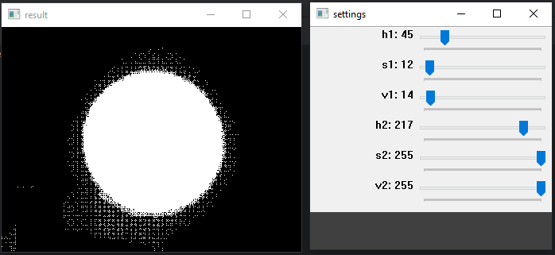
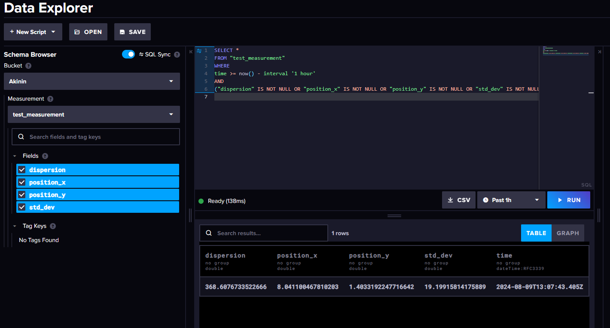

## Тестовое задание 1
### HSV редактор
Был создан побочный файл hsv_image.py для определения начального и конечного цветового фильтра, накладываемого на изображения при определении размера пятна.

Таблица итоговых значений:

|   | lower | upper |
|-| - |-|
| H | 64  | 76 |
| S | 239  | 255 |
| V | 220  | 255 |

### Influx DB
Результат передачи зачений в базу данных:

### Вывод программы
_[8.04110047 1.40331922] 19.19915814175889 368.6076733522666\
Большое расхождение с валидными значениями! ([0, 0] 10 10)_ 
